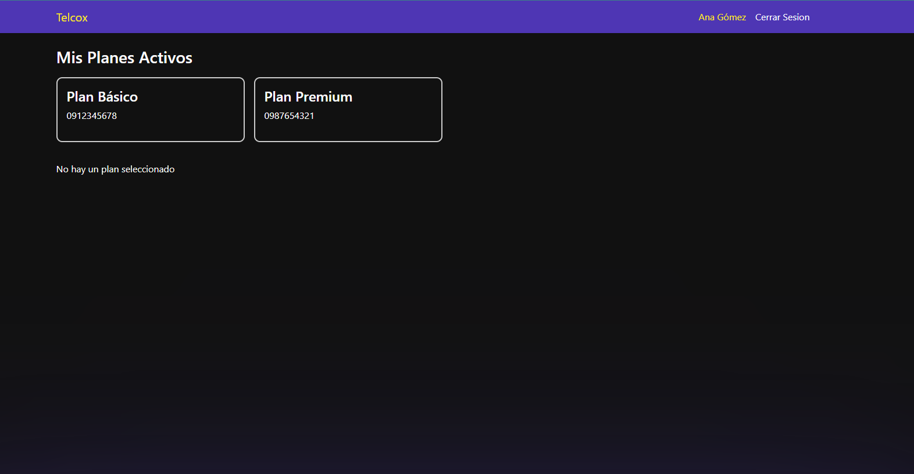

<p align="center">
  <a href="https://github.com/xander-on/telcox#" target="blank">
    <h1>Telcox Project</h1>
  </a>
  <h4>Desarrollador: Alexander Moreno</h4>
</p>

## Tecnologias usadas
- Frontend: React + TypeScript, CSS3, Bootstrap.
- Backend: Python Django.
- Base de Datos: MySQL.
- DevOps: Docker y Docker Compose.

## Requisitos previos
Antes de comenzar, asegúrate de tener instalado:

- Docker
- Docker Compose


## Descargar y levantar el proyecto

1. Clonar el proyecto de github

```
https://github.com/xander-on/telcox.git
```

2. clonar el archivo .env.template de la raiz y renombrar a ```.env``` al ser una prueba se dejo los valores para el archivo


3. Construir las imágenes (esto instala dependencias y prepara los contenedores)
```
docker-compose build
```

4. Levantar los servicios
```
docker-compose up -d
```

5. Ejecutar el seed para cargar informacion en la base de datos, ejecutar en la terminal
```
curl -X POST http://localhost:8000/api/seed/
``` 
deberias tener una salida como la siguiente 
```
{"message":"✅ Datos de prueba creados con consumos históricos"}
```
si no es asi puedes volver a intentar ejecutar el comando anterior el contenedor de la base de datos suele tardar un poco en levantarse la primera vez


6. Una vez que todo este funcionando correctamente puedes acceder ene el navegador
```
http://localhost:5173
```

## Repositorio del proyecto
<a href="https://github.com/xander-on/telcox#" target="blank">
  <h3>Github</h3>
</a>

```
https://github.com/xander-on/telcox#
```

## Documentacion de la api
<a href="https://documenter.getpostman.com/view/11619860/2sB3QJMq79" target="blank">
  <h3>Telcox api</h3>
</a>

```
https://documenter.getpostman.com/view/11619860/2sB3QJMq79
```


## Screenshots





